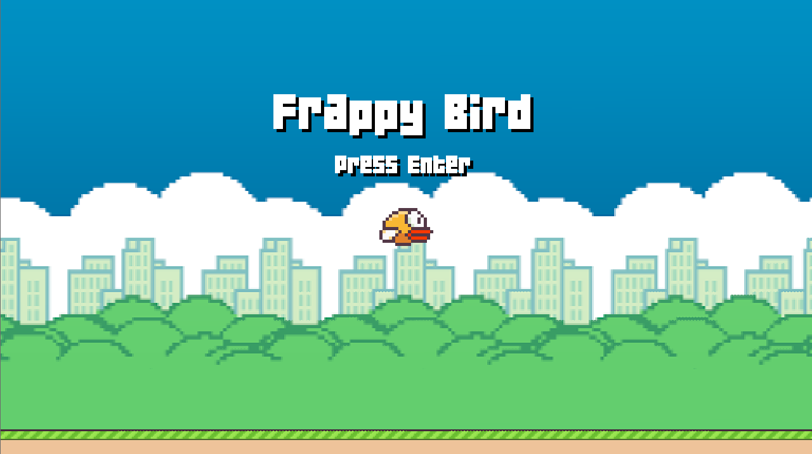
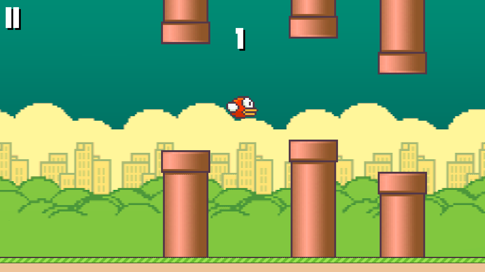
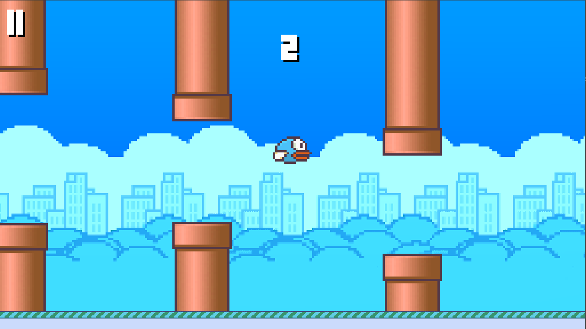
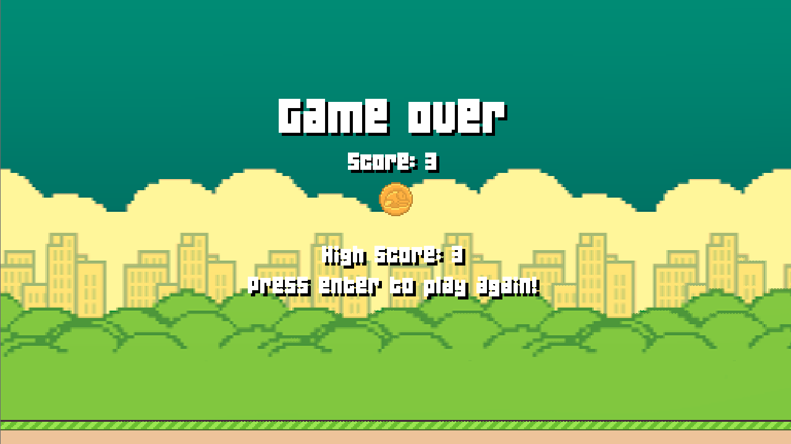

# 
***Lecture 1* on "S50's Intro to Game Development" course, available on [YouTube](https://www.youtube.com/playlist?list=PLWKjhJtqVAbluXJKKbCIb4xd7fcRkpzoz)**
    
Implementation of mobile game ["Flappy Bird"](https://pt.wikipedia.org/wiki/Flappy_Bird).



## Objectives

- [x] Implement a version from the game Flappy Bird, where the bird is moved by input detected from the keyboard.
- [x] Influence the generation of pipes so as to bring about more complicated level generation.
- [x] Give the player a medal for their performance, along with their score.
- [x] Implement a pause feature, just in case life gets in the way of jumping through pipes!

## Possible updates

- [x] The bird is moved by input detected from the mouse.
- [x] Pause feature.
- [x] High-score feature.

## Installation

### Build

First, you have to install [LÖVE2D](https://love2d.org/), then run the following.

```bash
    git clone https://github.com/daniellopes04/pong
    cd pong
    love .
```

### Run

Simply go to ["Resources"](https://github.com/daniellopes04/pong/tree/main/resources) folder and download the version compatible with your system.

## Features

### 1. Controls

* Space bar or mouse click - Bird fly
* "P" - Pause
* "ESC" - Quit
* "Enter" - Start

### 2. Day/Night cycle 




### 3. High-score


